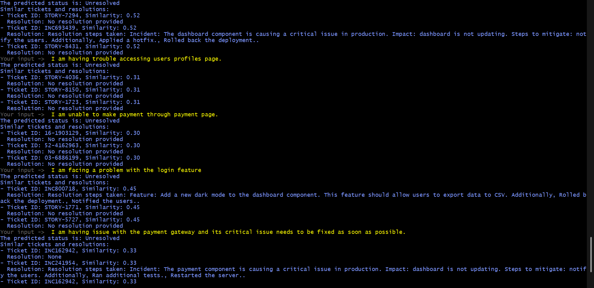

Guide to train chat bot on new API/data.

## Train Bot
`rasa train`

## Run Bot Server
`rasa run`

## Run any custom actions
`rasa run actions`

## To Interact with the Bot on terminal
`rasa shell`

If you are encountering running rasa shell on bash terminal because of winpty missing. Try to run on powershell with the activating the python venv.
To run in bash use `winpty rasa shell`

Also, you can interact directly with the custom actions by making POST REST Calls. If you are running on your local server.
Host - `http://localhost:5055/webhook`

## To connect with the UI, run this command
`rasa run --cors "*"`

### Results

