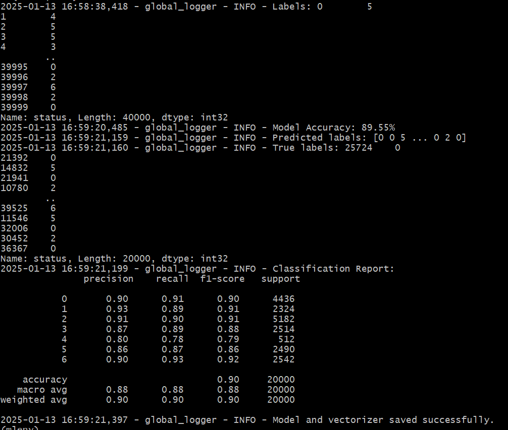

# Training Model

## Setup Virtual Python environment using 3.8.10

## Upgrade pip

### Training cmds
` python resolution_trainer.py`

This will generate model and vector file in sub directory called `\trained_model`.

Next, we will use this trained model to pass new incident ticket information to predict, if this model can find similar Incident or Ticket related to it. 

### Running prediction cmd
`python resolution_prediction.py`

This should return a result.

`